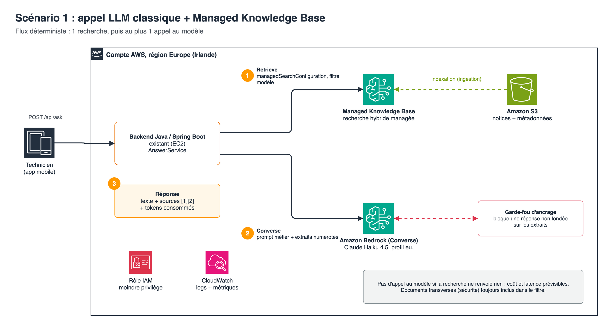

# Technician assistant: Spring AI + Amazon Bedrock Managed Knowledge Base (Java)

Demo of an assistant that answers a maintenance technician's questions from the manufacturers' technical documentation (manuals, fault codes, procedures), and only from it.

This is **scenario 1: classic LLM call**. The service runs a Knowledge Base search, one model call, then a grounding check on the answer. Scenario 2 (agent on AgentCore Runtime) lives in the `agentcore-managed-kb-agent-java` repository and reuses the same Knowledge Base.

Stack: **Java 25, Spring Boot 4.1, Spring AI 2.0.1**, Claude Haiku 4.5 (`eu.` inference profile), Region `eu-west-1`, infrastructure in **Terraform**.

The sample documentation and the answers are in French: the target users are French-speaking technicians. Code, comments and docs are in English.



## How it works

1. **Retrieval**: a Spring AI `VectorStore` implemented on the Managed Knowledge Base (`ManagedBedrockVectorStore`). When the equipment model is known, the search is filtered on that model (`model` metadata), plus cross-model documents such as safety procedures (`model = ALL`).
2. **Generation**: Spring AI `ChatClient` on Bedrock Converse, with a domain prompt in markdown (`src/main/resources/prompts/system-prompt.md`) and the numbered excerpts.
3. **Grounding check**: `ApplyGuardrail` (Amazon Bedrock Guardrails, contextual grounding) checks that the answer is grounded in the excerpts and relevant to the question. Otherwise it is replaced by a neutral message. The check **fails closed**: a missing or incomplete evaluation (no score, text out of limits) blocks the answer. It is mandatory: the application refuses to start without `GUARDRAIL_ID` and `GUARDRAIL_VERSION`.
4. The answer comes back with its sources, grounding scores and consumption (tokens, guardrail units), to track the cost per question.

If the search returns no excerpt, the model is not called: `NOT_FOUND`, no inference cost.

## Spring AI or AWS SDK: a hybrid approach, layer by layer

Spring AI and the AWS SDK each have a strength: Spring AI reduces code and keeps the model swappable, the SDK follows Bedrock without delay. So we take the best of each at every layer.

| Layer | Choice | Why |
|---|---|---|
| Prompt, model call | Spring AI `ChatClient` | Less code, model changed by configuration |
| Retrieval abstraction | Spring AI `VectorStore`, `SearchRequest`, filter expressions | Application code independent from the search engine |
| `Retrieve` on the managed Knowledge Base | AWS SDK (`bedrockagentruntime`), wrapped in `ManagedBedrockVectorStore` | The Spring AI 2.0.1 Bedrock Knowledge Base vector store always sends `vectorSearchConfiguration`, which a managed Knowledge Base rejects |
| Grounding check | AWS SDK (`bedrockruntime` `ApplyGuardrail`) | Spring AI 2.0.1 passes neither `guardrailConfig` nor `guardContent` blocks to Converse (checked in `BedrockChatOptions` 2.0.1). `ApplyGuardrail` is the AWS API for a model-independent guardrail |

Rule: **Spring AI where it saves time, the SDK where Bedrock moves faster than Spring AI.** When Spring AI covers managed Knowledge Bases or guardrails, one class is replaced and the rest of the code does not move.

Retrieval is called explicitly rather than through `QuestionAnswerAdvisor`, for two reasons: do not call the model when the documentation contains nothing, and reuse exactly the same excerpts as the source of truth of the grounding check.

### Why two calls (retrieval then generation) instead of one

A managed Knowledge Base is queried with `Retrieve` (`managedSearchConfiguration`) or with agentic retrieval (`AgenticRetrieveStream`). `vectorSearchConfiguration` and `RetrieveAndGenerate` belong to vector Knowledge Bases. `RetrieveAndGenerate` also chains a search and a generation on the service side: moving to two calls mostly adds one network round trip, negligible next to generation. The token volume depends on the prompt you build (ours adds a domain prompt), and the grounding check is billed separately. In exchange, you keep control of the domain prompt, the model, the guardrail and the answer format.

```java
SearchRequest.builder()
        .query("Que signifie le code F28 ?")
        .topK(5)
        .filterExpression(b.or(b.eq("model", "Condensa 24"), b.eq("model", "ALL")).build())
        .build();
// -> Retrieve with managedSearchConfiguration { numberOfResults: 5, filter: orAll[...] }
```

## Prerequisites

- AWS account, Region `eu-west-1`, access to Claude Haiku 4.5 enabled in Amazon Bedrock
- Terraform 1.9 or later (provider `hashicorp/aws` 6.67 or later), AWS CLI v2, `jq`
- Java 25, Maven 3.9

## Deploy

```bash
AWS_PROFILE=<profile> EXPECTED_ACCOUNT_ID=<account> ./scripts/deploy.sh
```

The script runs `terraform apply` in `infra/` (encrypted bucket, `sample-docs/` documentation, managed Knowledge Base with its S3 connector, grounding guardrail, application IAM policy), starts the indexing and writes the local configuration to `.deploy/outputs.sh`.

| Terraform file | Content |
|---|---|
| `storage.tf` | Documentation bucket (encryption, versioning, public access blocked, TLS required) and upload of the manuals with their `.metadata.json` |
| `knowledge_base.tf` | Service role, Knowledge Base `type = "MANAGED"`, data source `MANAGED_KNOWLEDGE_BASE_CONNECTOR` (S3) |
| `guardrail.tf` | Contextual grounding guardrail (grounding and relevance thresholds) and its published version |
| `application_iam.tf` | Policy to attach to the backend role: `Retrieve`, EU inference profile, `ApplyGuardrail` |

## Run and test

```bash
source .deploy/outputs.sh
mvn spring-boot:run

./scripts/ask.sh "Que signifie le code défaut F28 ?"
./scripts/ask.sh "Que signifie le code défaut F28 ?" "Condensa 24"
./scripts/ask.sh "Quel est le prix d'une Condensa 24 neuve ?" "Condensa 24"
./scripts/ask.sh "Je sens une odeur de gaz en arrivant, que faire ?"
```

- **F28 without a model**: F28 does not mean the same thing on the two boilers of the documentation. The assistant gives both and asks for the model.
- **F28 with the model**: a single, sourced answer.
- **Gas smell**: the safety instruction comes first (domain prompt rule).
- **Question outside the documentation**: `NOT_FOUND`, the assistant says so instead of inventing.

Results measured on this documentation (indicative):

| Question | Status | Grounding | Relevance | Input / output tokens | Latency |
|---|---|---|---|---|---|
| F28 without a model | ANSWERED (2 models, asks which one) | 0.91 | 1.0 | 2,205 / 280 | 3.8 s |
| F28 Condensa 24 | ANSWERED | 1.0 | 1.0 | 2,239 / 149 | 2.9 s |
| F28 Ecoline 35 | ANSWERED | 1.0 | 1.0 | 1,243 / 154 | 2.7 s |
| CO2 at full power (G20), Condensa 24 | ANSWERED | 0.99 | 1.0 | 1,656 / 60 | 1.9 s |
| Gas smell (safety instruction) | ANSWERED | 0.65 | 0.84 | 1,758 / 177 | 3.2 s |
| Front panel tightening torque (not in the doc) | refusal (see below) | n/a | n/a | 1,287 / 59 | 1.8 s |
| Price of a Condensa 24 | refusal (see below) | n/a | n/a | 1,651 / 57 | 1.7 s |

Refusals: if the model replies with exactly the refusal sentence of the prompt, the status is `NOT_FOUND`, with no grounding check (nothing to check). If it adds an explanation, the answer goes through the check like any other and comes back as `ANSWERED` with the refusal text.

Temperature 0: in these runs the same questions gave the same scores from one call to the next. This is an observation, not a guarantee (search ranking and guardrail scores can vary).

Answer shape:

```json
{
  "answer": "...",
  "status": "ANSWERED",
  "sources": [{ "index": 1, "document": "thermalys-condensa-24-notice-technique.md", "model": "Condensa 24", "score": 0.61 }],
  "usage": { "modelId": "eu.anthropic.claude-haiku-4-5-20251001-v1:0", "inputTokens": 2172, "outputTokens": 149, "guardrailUnits": 5, "latencyMs": 3166 },
  "grounding": { "groundingScore": 1.0, "relevanceScore": 1.0 }
}
```

`status` is `ANSWERED`, `NOT_FOUND` (nothing in the documentation, or exact refusal from the model) or `BLOCKED` (grounding check below threshold or not possible).

## System prompt

The prompt in `src/main/resources/prompts/` follows the [Claude prompting best practices](https://docs.claude.com/en/docs/build-with-claude/prompt-engineering/claude-4-best-practices): one role with the reason behind it (a wrong value can put someone at risk), sections in XML tags, rules stated plainly with their reason instead of capital letters, the output format described in prose, and retrieved content passed as data in tags. The rules match what the code enforces, so the prompt never promises more than the guardrail checks. Replay a fixed set of real questions after any change to it, and keep the change only if the answers do not get worse.

## Tests

```bash
mvn test
```

27 unit tests, no AWS call: `Retrieve` always with `managedSearchConfiguration` (never `vectorSearchConfiguration`), translation of the Spring AI filters used by the demo (equality, groups, `&&`, `||`, explicit refusal of other operators), similarity threshold, no model call without excerpts, grounding check qualifiers (`grounding_source`, `query` = the question only, `guard_content`), blocking when the guardrail does not return both scores or when the text exceeds its limits, tags neutralised in excerpts and question, exact refusal reported as `NOT_FOUND`, API validation and error mapping.

## Sample documentation

`sample-docs/` contains **fictitious** documentation (invented manufacturers and models): two gas boilers where F28 does not mean the same thing, a heat pump and a safety procedure. Each document has a `.metadata.json` file (`manufacturer`, `model`, `equipment_type`, `document_type`) used for filtering. For real manuals, upload the PDFs with the same kind of metadata file, or connect SharePoint, Confluence or Google Drive as the Knowledge Base source. Image extraction (diagrams) is enabled on the connector.

## Architecture choices (AWS Well-Architected)

| Pillar | What is in place |
|---|---|
| Security | No static key (default credentials chain, IAM role in production). Application IAM policy limited to the Knowledge Base, the European inference profile and the guardrail. Encrypted bucket, public access blocked, TLS required. Knowledge Base role limited to the bucket, with `aws:SourceAccount` and `aws:SourceArn` conditions. Input validation (1,000 characters max, the query limit of the grounding check). API listening on `127.0.0.1` by default. Excerpts and question treated as data: angle brackets neutralised and an explicit prompt rule against instruction injection. |
| Reliability | Standard SDK retries, explicit timeouts, Bedrock and Knowledge Base throttling returned as 429, fail-closed grounding check, time-bounded indexing at deploy time, infrastructure described in Terraform. |
| Performance efficiency | Hybrid search managed by the service, metadata filtering, short answers designed for a phone screen. |
| Cost optimisation | Light model by default (changed without code through `MODEL_ID`), no model call without excerpts, token cap, tokens and guardrail units returned with each answer. |
| Operational excellence | One key=value log line per question (status, excerpts, tokens, grounding scores, latency), health endpoint, deploy and destroy scripts, checkov and Semgrep with no blocking finding. |
| Sustainability | Managed and serverless services, no idle reserved capacity. |

## Before production

- **Authentication**: the API carries no authentication. It is designed to be plugged into the existing backend and exposed behind its authentication. Do not expose it as is (`SERVER_ADDRESS` only opens behind that authentication).
- **IAM role**: attach the `application_policy_arn` policy to the backend role (Terraform variable `application_role_name`) and test with that role only, not with an admin profile.
- **Controls not enabled for the demo** (marked `checkov:skip` with the reason in `infra/storage.tf`): customer managed KMS key on the bucket, S3 access logging, cross-Region replication, event notifications.
- **Terraform state**: move to the S3 backend commented out in `infra/versions.tf`.
- **Network**: add VPC endpoints (AWS PrivateLink) for Amazon Bedrock if the backend runs in private subnets.
- **Evaluation**: build a set of 20 to 30 real technician questions with the right answer, and replay it on every change of model, prompt or threshold.
- **Guardrail thresholds**: `grounding_threshold` (0.5) and `relevance_threshold` (0.5) must be calibrated on that evaluation set. Measured here: a faithful answer that rephrases a list of instructions (gas smell) scores 0.65; at 0.7 it was wrongly blocked. Too high blocks good answers, too low lets approximations through: only a real evaluation set can decide.

## Delete the resources

```bash
AWS_PROFILE=<profile> EXPECTED_ACCOUNT_ID=<account> ./scripts/destroy.sh
```

Delete scenario 2 first if it is deployed: it uses this Knowledge Base.

## References

- [Build enterprise search for agents with Amazon Bedrock Managed Knowledge Base](https://aws.amazon.com/blogs/machine-learning/build-enterprise-search-for-agents-with-amazon-bedrock-managed-knowledge-base/)
- [Amazon S3 connector for a managed Knowledge Base](https://docs.aws.amazon.com/bedrock/latest/userguide/kb-managed-ds-s3.html)
- [Service role for managed Amazon Bedrock Knowledge Bases](https://docs.aws.amazon.com/bedrock/latest/userguide/kb-managed-permissions.html)
- [Contextual grounding check with ApplyGuardrail](https://docs.aws.amazon.com/bedrock/latest/userguide/guardrails-contextual-grounding-check.html)
- [Terraform `aws_bedrockagent_knowledge_base`](https://registry.terraform.io/providers/hashicorp/aws/latest/docs/resources/bedrockagent_knowledge_base)

## License

This project is licensed under the MIT-0 License. See the [LICENSE](LICENSE) file.
